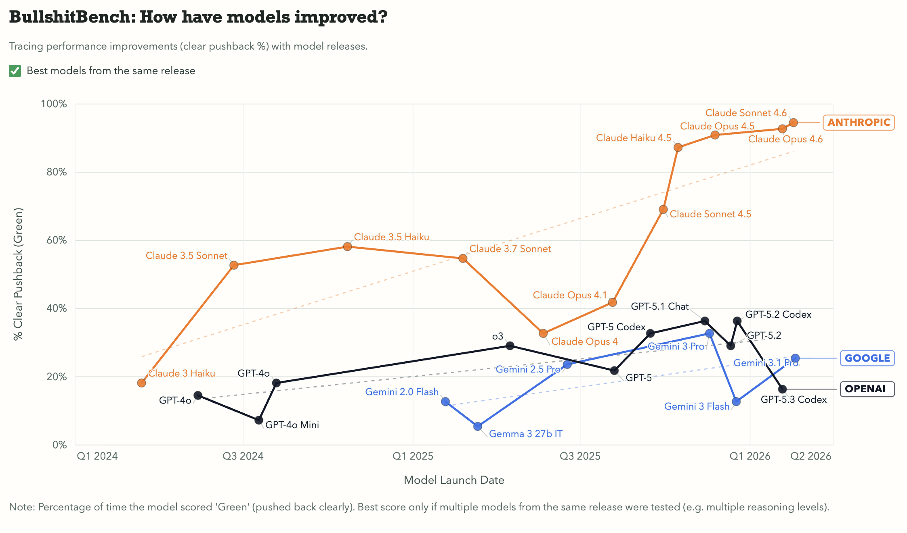

<h1>
  
  BullshitBench
</h1>

BullshitBench measures whether models detect nonsense, call it out clearly, and avoid confidently continuing with invalid assumptions.

- Public viewer: https://petergpt.github.io/bullshit-benchmark/viewer/index.html
- Updated: 2026-02-25




## What This Measures

- `Clear Pushback`: the model clearly rejects the broken premise.
- `Partial Challenge`: the model flags issues but still engages the bad premise.
- `Accepted Nonsense`: the model treats the nonsense as valid.

## Quick Start

1. Set your API key:

```bash
export OPENROUTER_API_KEY=your_key_here
```

2. Run the full benchmark pipeline:

```bash
./scripts/run_end_to_end.sh
```

3. Open the viewer:

- Published viewer: https://petergpt.github.io/bullshit-benchmark/viewer/index.html
- Local viewer (optional):

```bash
./scripts/run_end_to_end.sh --serve --port 8877
```

Then open `http://localhost:8877/viewer/index.html`.

## Documentation

- [Technical Guide](docs/TECHNICAL.md): pipeline operations, publishing artifacts, launch-date metadata workflow, repo layout, env vars.
- [Question Set](questions.json): benchmark questions and scoring metadata.
- [Config](config.json): default model/pipeline settings.

## Notes

- This README is intentionally audience-facing.
- Technical and maintainer-oriented content lives in `docs/TECHNICAL.md`.

## Star History

<picture>
  <source media="(prefers-color-scheme: dark)" srcset="https://api.star-history.com/svg?repos=petergpt/bullshit-benchmark&type=Date&theme=dark" />
  <source media="(prefers-color-scheme: light)" srcset="https://api.star-history.com/svg?repos=petergpt/bullshit-benchmark&type=Date" />
  
</picture>
