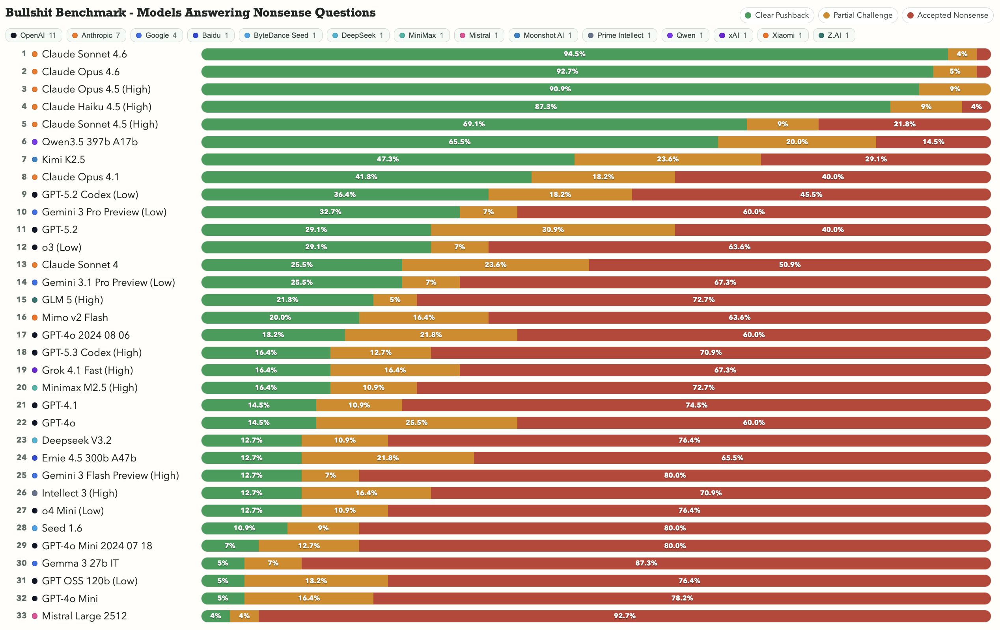

# Bullshit Benchmark

Bullshit Benchmark tests whether models challenge nonsensical prompts instead of confidently answering them.

## Bullshit Benchmark Results



Updated: 2026-02-25

## Public Viewer

- GitHub Pages: https://petergpt.github.io/bullshit-benchmark/viewer/index.html

## What This Measures

- `Clear Pushback`: model clearly identifies and rejects the broken premise.
- `Partial Challenge`: model raises concerns but still engages the bad premise.
- `Accepted Nonsense`: model treats nonsense as valid and proceeds confidently.

The benchmark uses judge-model panel grading over responses collected from `questions.json`.

## Quick Start

Run the full pipeline and publish the latest viewer dataset:

```bash
./scripts/run_end_to_end.sh
```

This runs:

1. `collect`
2. `grade-panel`
3. `publish_latest_to_viewer.sh` (updates `data/latest`)

To serve locally after publishing:

```bash
./scripts/run_end_to_end.sh --serve --port 8877
```

Then open `http://localhost:8877/viewer/index.html`.

## Publish Existing Run Artifacts

Use this when you already have run outputs and only want to refresh `data/latest`:

```bash
./scripts/publish_latest_to_viewer.sh \
  --responses-file <path/to/responses.jsonl> \
  --collection-stats <path/to/collection_stats.json> \
  --panel-summary <path/to/panel_summary.json> \
  --aggregate-summary <path/to/aggregate_summary.json> \
  --aggregate-rows <path/to/aggregate.jsonl>
```

The publish step strips local-machine path fields from public artifacts.

## Launch-Date Metadata Pipeline

Build model launch-date inventory/buckets and export review/candidate/canonical launch datasets:

```bash
./scripts/model_launch_pipeline.py run
```

This writes:

- `data/model_metadata/tested_models_inventory.csv`
- `data/model_metadata/model_buckets.csv`
- `data/model_metadata/model_launch_sources.csv` (template if missing)
- `data/model_metadata/model_launch_collection.csv`
- `data/model_metadata/model_launch_judged.csv`
- `data/model_metadata/model_launch_attempts.csv`
- `data/model_metadata/model_launch_dates_review.csv`
- `data/model_metadata/model_launch_dates_candidates.csv`
- `data/model_metadata/model_launch_dates.csv` (canonical accepted rows)

Publishing now also exports:

- `data/latest/model_launch_dates.csv`
- `data/latest/leaderboard_with_launch.csv`

## Current Config Notes

- Main config: `config.json`
- Question set: `questions.json`
- Recent published snapshot includes `openai/gpt-5.2-codex` and `openai/gpt-5.3-codex` variants across reasoning levels (`low`, `high`, `xhigh`) in `data/latest/leaderboard.csv`.

## Repository Layout

- `scripts/openrouter_benchmark.py`: core CLI (`collect`, `grade`, `grade-panel`, `aggregate`, `report`)
- `scripts/run_end_to_end.sh`: one-command pipeline runner
- `scripts/publish_latest_to_viewer.sh`: publish run outputs into `data/latest`
- `scripts/cleanup_generated_outputs.sh`: remove generated local artifacts
- `viewer/index.html`: canonical interactive viewer
- `data/latest/*`: canonical published dataset used by the viewer
- `runs/*`: local run history

## Published Dataset Files

`data/latest` contains:

- `responses.jsonl`
- `collection_stats.json`
- `panel_summary.json`
- `aggregate_summary.json`
- `aggregate.jsonl`
- `leaderboard.csv`
- `leaderboard_with_launch.csv`
- `model_launch_dates.csv`
- `manifest.json`

## Environment

Required:

- `OPENROUTER_API_KEY`

Optional:

- `OPENROUTER_REFERER`
- `OPENROUTER_APP_NAME`
