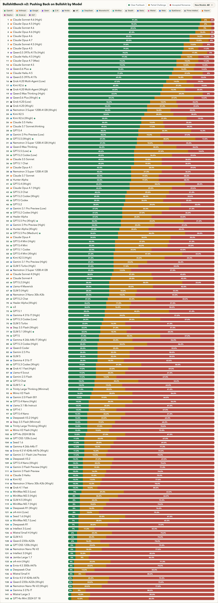
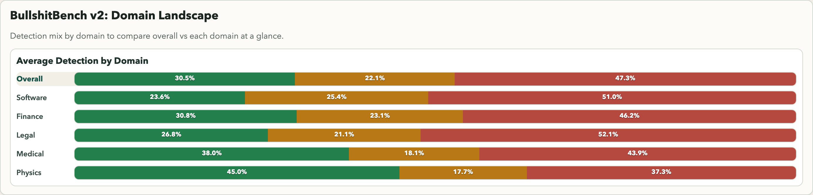
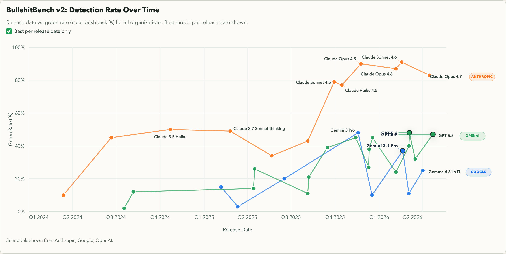
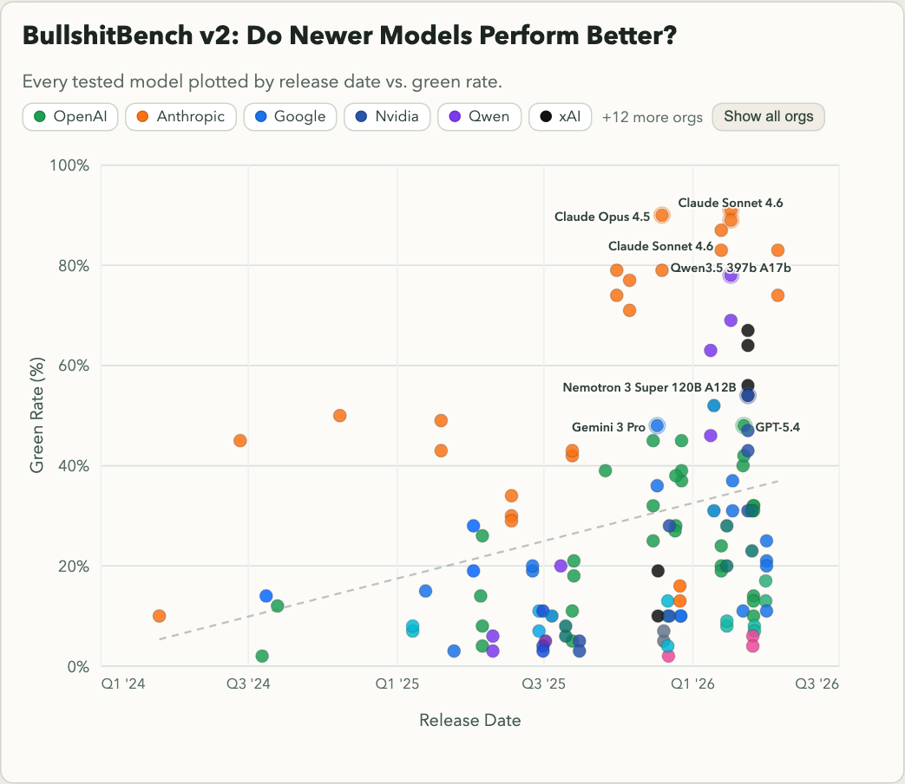
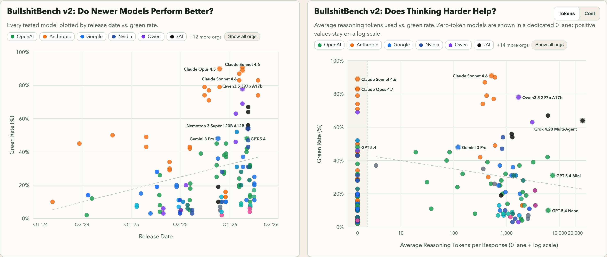
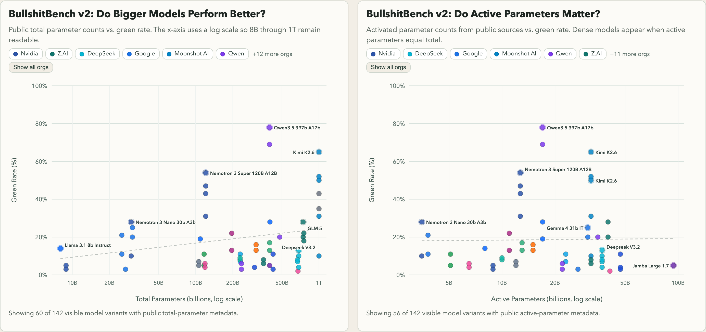

<h1>
  
  BullshitBench v2
</h1>

BullshitBench measures whether models detect nonsense, call it out clearly, and avoid confidently continuing with invalid assumptions.

- Public viewer (latest): https://petergpt.github.io/bullshit-benchmark/viewer/index.v2.html
- Updated: 2026-04-27

## Latest Changelog Entry (2026-04-27)

- Added DeepSeek V4, Tencent Hy3 Preview, and Xiaomi MiMo V2.5 benchmark results to both published tracks: `v1` with `55` questions per reasoning variant and `v2` with `100` questions per reasoning variant.
- Published:
  - `deepseek/deepseek-v4-flash@reasoning=none`
  - `deepseek/deepseek-v4-flash@reasoning=xhigh`
  - `deepseek/deepseek-v4-pro@reasoning=none`
  - `deepseek/deepseek-v4-pro@reasoning=xhigh`
  - `tencent/hy3-preview:free@reasoning=none`
  - `tencent/hy3-preview:free@reasoning=xhigh`
  - `xiaomi/mimo-v2.5@reasoning=none`
  - `xiaomi/mimo-v2.5@reasoning=xhigh`
  - `xiaomi/mimo-v2.5-pro@reasoning=none`
  - `xiaomi/mimo-v2.5-pro@reasoning=xhigh`
- Added canonical launch-date and model-size metadata for the new DeepSeek, Tencent, and Xiaomi rows.
- Updated durable v1/v2 config coverage and refreshed the published leaderboard, release-date, reasoning-token/cost, and model-size chart data from completed 3-judge panels.
- Full details: [CHANGELOG.md](CHANGELOG.md)

## v2 Changelog Highlights

- `100` new nonsense questions in the v2 set.
- Domain-specific question coverage across `5` domains: `software` (40), `finance` (15), `legal` (15), `medical` (15), `physics` (15).
- New visualizations in the v2 viewer, including:
  - Detection Rate by Model (stacked mix bars)
  - Domain Landscape (overall vs domain detection mix)
  - Detection Rate Over Time
  - Do Newer Models Perform Better?
  - Does Thinking Harder Help? (tokens/cost toggle)
  - Model Size and Weights (total/active parameter scatter views)

## Viewer Walkthrough (v2)

The screenshots below follow the same flow as `viewer/index.v2.html`, starting with the main chart.

### 1. Detection Rate by Model (Main Chart)

Primary leaderboard-style view showing each model's green/amber/red split.



### 2. Domain Landscape

Detection mix by domain to compare overall performance vs each domain at a glance.



### 3. Detection Rate Over Time

Release-date trend view focused on Anthropic, OpenAI, and Google.



### 4. Do Newer Models Perform Better?

All-model scatter by release date vs. green rate.



### 5. Does Thinking Harder Help?

Reasoning scatter (tokens/cost toggle in the viewer) vs. green rate.



### 6. Model Size and Weights

Total and active parameter scatter views for models with public size metadata.



## Benchmark Scope (v2)

- `100` nonsense prompts total.
- `5` domain groups: `software` (40), `finance` (15), `legal` (15), `medical` (15), `physics` (15).
- `13` nonsense techniques (for example: `plausible_nonexistent_framework`, `misapplied_mechanism`, `nested_nonsense`, `specificity_trap`).
- `3`-judge panel aggregation (`anthropic/claude-sonnet-4.6`, `openai/gpt-5.2`, `google/gemini-3.1-pro-preview`) using `full` panel mode + `mean` aggregation.
- Published v2 leaderboard currently includes `152` model/reasoning rows.

## What This Measures

- `Clear Pushback`: the model clearly rejects the broken premise.
- `Partial Challenge`: the model flags issues but still engages the bad premise.
- `Accepted Nonsense`: the model treats the nonsense as valid.

## Quick Start

1. Set API keys:

```bash
export OPENROUTER_API_KEY=your_key_here
export OPENAI_API_KEY=your_openai_key_here  # required only for models routed to OpenAI
export OPENAI_PROJECT=proj_xxx              # optional: force OpenAI requests to a specific project
export OPENAI_ORGANIZATION=org_xxx          # optional: force organization context
```

Provider routing is configured per model via `collect.model_providers` and
`grade.model_providers` in config (default is OpenRouter), for example:
`{"*":"openrouter","gpt-5.3":"openai"}`.

2. Run collection + primary judge (Claude by default):

```bash
./scripts/run_end_to_end.sh
```

3. Run v2 end-to-end and publish into the dedicated v2 dataset:

```bash
./scripts/run_end_to_end.sh --config config.v2.json --viewer-output-dir data/v2/latest --with-additional-judges
```

4. Optionally run the default config end-to-end (publishes to `data/latest`):

```bash
./scripts/run_end_to_end.sh --with-additional-judges
```

5. Open the viewer:

- Published viewer (latest): https://petergpt.github.io/bullshit-benchmark/viewer/index.v2.html
- Local viewer (optional):

```bash
./scripts/run_end_to_end.sh --with-additional-judges --serve --port 8877
```

Then open `http://localhost:8877/viewer/index.v2.html`.
Use the `Benchmark Version` dropdown in the filters panel to switch between published datasets (for example `v1` and `v2`).

## Published Datasets

- v1 dataset remains in `data/latest`.
- v2 dataset is published in `data/v2/latest`.
- v2 question set comes from `drafts/new-questions.md` via `scripts/build_questions_v2_from_draft.py`.
- Canonical judging is now fixed to exactly 3 judges on every row with mean aggregation (legacy disagreement-tiebreak mode is retired from the main pipeline).
- Release notes and notable changes are tracked in `CHANGELOG.md`.

## Documentation

- [Technical Guide](docs/TECHNICAL.md): pipeline operations, publishing artifacts, launch-date metadata workflow, repo layout, env vars.
- [Changelog](CHANGELOG.md): v1 to v2 release notes and publish-history highlights.
- [Question Set](questions.json): benchmark questions and scoring metadata.
- [Question Set v2](questions.v2.json): v2 question pool generated from `drafts/new-questions.md`.
- [Config](config.json): default model/pipeline settings.
- [Config v2](config.v2.json): v2-ready config (uses `questions.v2.json`).

## Notes

- This README is intentionally audience-facing.
- Technical and maintainer-oriented content lives in `docs/TECHNICAL.md`.

## License

MIT. See [LICENSE](LICENSE).

## Star History 

<picture>
  <source media="(prefers-color-scheme: dark)" srcset="https://api.star-history.com/svg?repos=petergpt/bullshit-benchmark&type=Date&theme=dark&cachebust=20260430" />
  <source media="(prefers-color-scheme: light)" srcset="https://api.star-history.com/svg?repos=petergpt/bullshit-benchmark&type=Date&cachebust=20260430" />
  
</picture>
