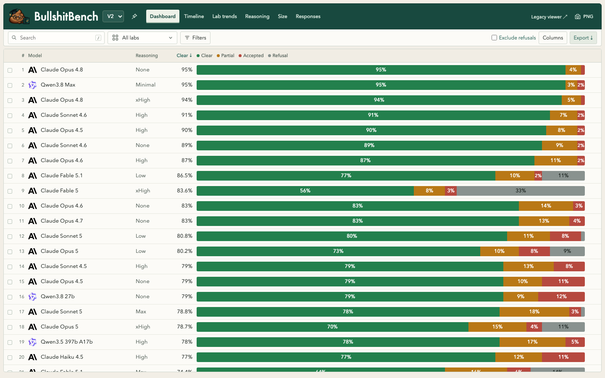
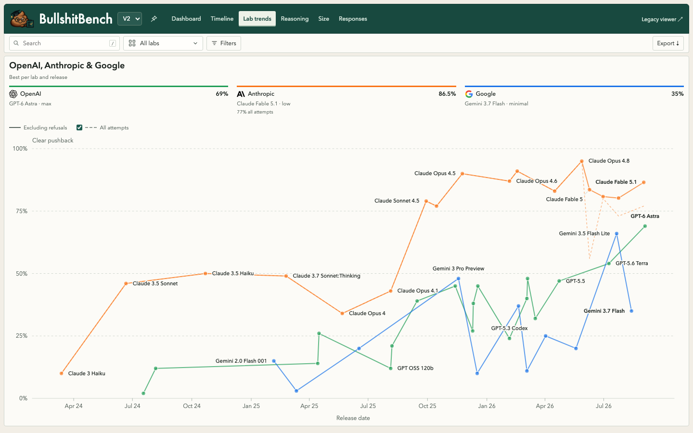

<h1>
  
  BullshitBench
</h1>

BullshitBench measures whether models detect nonsense, call it out clearly, and avoid confidently continuing with invalid assumptions.

**[Explore the results](https://petergpt.github.io/bullshit-benchmark/)** · [Methodology](docs/TECHNICAL.md) · [Data](#data)

Updated **September 10, 2026**. The new dashboard is now the default viewer. The latest completed results include **DeepSeek V4.1 Flash**, **Claude Fable 5.1** and **GPT-6 Astra**, each tested at low and maximum reasoning.

| Suite | Questions | Model/reasoning variants | Responses |
| --- | ---: | ---: | ---: |
| V1 | 55 | 194 | 10,670 |
| V2 | 100 | 214 | 21,400 |

## Explore

Filter by lab, reasoning or domain; sort by clear pushback, least accepted or average grade; compare answers; and export PNGs or CSVs. Optional columns show grade, token usage and cost.



Timeline, Lab trends, Reasoning and Size views use the same results. Lab trends follows each lab's best model at each release date. Dotted lines show the all-attempt rate of the same model where it differs.



## Scoring

A three-judge panel evaluates responses: Claude Sonnet 4.6, GPT-5.2 and Gemini 3.1 Pro Preview. Their average determines the category:

- **Clear pushback:** rejects the broken premise.
- **Partial challenge:** flags problems but still engages with the premise.
- **Accepted nonsense:** treats the premise as valid.

**Clear score = clear answers ÷ (attempts − candidate refusals).** Errors remain in the denominator. Bars include refusals by default; tick **Exclude refusals** to remove them from the bars. Model details and CSV exports include both rates. Canonical leaderboard CSVs retain all-attempt rates.

Failed judges receive three output attempts. After those are exhausted, two valid grades may be averaged; affected answers show **2/3 judges**. Missing votes remain unscored. See the [scoring and publication rules](docs/TECHNICAL.md#missing-judge-evaluations).

V2 covers **13 nonsense techniques** across software, finance, legal, medical and physics questions. This tests responses to invalid premises; it does not measure how often models incorrectly reject valid questions.

## Run Locally

No build step or API keys are needed to view results. From the repository root:

```bash
python3 -m http.server 8795 --bind 127.0.0.1
```

Open [the local dashboard](http://127.0.0.1:8795/). The [Viewer Guide](viewer/next/README.md) covers filters, comparisons and exports.

To run your own evaluations, use [config.json](config.json) for V1 or [config.v2.json](config.v2.json) for V2 and follow the [Technical Guide](docs/TECHNICAL.md). Collection and grading use paid provider APIs; review the selected models first.

## Data

- **V1:** [manifest](data/latest/manifest.json) · [leaderboard CSV](data/latest/leaderboard.csv) · [questions](questions.json)
- **V2:** [manifest](data/v2/latest/manifest.json) · [leaderboard CSV](data/v2/latest/leaderboard.csv) · [questions](questions.v2.json)
- [Technical Guide](docs/TECHNICAL.md) · [Changelog](CHANGELOG.md) · [Storage audit](docs/STORAGE_AUDIT.md)
- [Legacy viewer](https://petergpt.github.io/bullshit-benchmark/viewer/index.legacy.html)

Each manifest pins the exact question snapshot, metadata and immutable data files for its release. Full response and grade exports are split into bounded files; use the [manifest-aware reader](docs/TECHNICAL.md#published-dataset-files) to reconstruct JSONL.

## License

[MIT](LICENSE). Third-party brand assets have separate [source and license notes](viewer/next/assets/brands/SOURCES.md).

## Star History

<picture>
  <source media="(prefers-color-scheme: dark)" srcset="https://api.star-history.com/svg?repos=petergpt/bullshit-benchmark&type=Date&theme=dark&cachebust=20260912" />
  <source media="(prefers-color-scheme: light)" srcset="https://api.star-history.com/svg?repos=petergpt/bullshit-benchmark&type=Date&cachebust=20260912" />
  
</picture>
